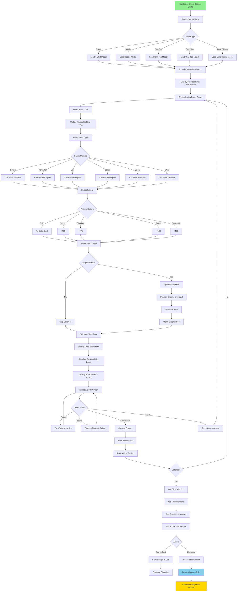

# 3D Design Studio User Flow

This diagram shows the complete user journey through the 3D customization interface.



## Design Studio Features

### **1. 3D Model Loading**

- **Technology**: Three.js, @react-three/fiber
- **Format**: GLB (Binary glTF)
- **Fallback**: Procedural geometry generation
- **Performance**: Lazy loading, texture optimization

### **2. Clothing Types Available**

| Type        | Model File     | Base Price |
| ----------- | -------------- | ---------- |
| T-Shirt     | tshirt.glb     | ₹500       |
| Hoodie      | hoodie.glb     | ₹800       |
| Tank Top    | tanktop.glb    | ₹400       |
| Crop Top    | croptop.glb    | ₹450       |
| Long Sleeve | longsleeve.glb | ₹600       |

### **3. Customization Options**

#### **Color Selection**

- Color picker with HEX/RGB input
- Pre-defined palette
- Real-time material update
- PBR (Physically Based Rendering) support

#### **Fabric Types**

| Fabric    | Multiplier | Sustainability Score | Texture      |
| --------- | ---------- | -------------------- | ------------ |
| Cotton    | 1.0x       | ⭐⭐⭐⭐⭐           | Natural      |
| Polyester | 0.8x       | ⭐⭐                 | Synthetic    |
| Silk      | 2.0x       | ⭐⭐⭐               | Luxury       |
| Denim     | 1.5x       | ⭐⭐⭐⭐             | Durable      |
| Linen     | 1.3x       | ⭐⭐⭐⭐⭐           | Eco-friendly |
| Wool      | 1.8x       | ⭐⭐⭐⭐             | Warm         |

#### **Patterns**

| Pattern   | Extra Cost | Complexity |
| --------- | ---------- | ---------- |
| Solid     | ₹0         | Simple     |
| Striped   | ₹50        | Medium     |
| Checked   | ₹75        | Medium     |
| Floral    | ₹100       | Complex    |
| Geometric | ₹80        | Medium     |

#### **Graphics/Logos**

- File upload (PNG, JPG, SVG)
- Max size: 5MB
- Positioning controls (X, Y coordinates)
- Scaling (0.1x - 3x)
- Rotation (0° - 360°)
- Extra cost: ₹200

### **4. Price Calculation Formula**

```javascript
basePrice = clothingType.price; // e.g., ₹500 for T-shirt
fabricCost = basePrice * fabricMultiplier;
patternCost = pattern.cost; // e.g., ₹50 for striped
graphicCost = hasGraphic ? 200 : 0;

totalPrice = fabricCost + patternCost + graphicCost;
```

**Example Calculation**:

```
T-Shirt (₹500) + Silk (2.0x) + Floral (₹100) + Graphic (₹200)
= ₹500 × 2.0 + ₹100 + ₹200
= ₹1,300
```

### **5. Sustainability Scoring**

```javascript
sustainabilityScore =
  (fabricScore * 0.5 + organicDyes * 0.3 + localProduction * 0.2) * 100;
```

**Factors**:

- Fabric environmental impact (50%)
- Organic dye usage (30%)
- Local production (20%)

**Display**:

- Score: 0-100
- Rating: ⭐ to ⭐⭐⭐⭐⭐
- Carbon footprint estimate
- Water usage estimate

### **6. Interactive Controls**

#### **OrbitControls**

```javascript
- Auto-rotate: Optional
- Damping: Enabled for smooth movement
- Zoom limits: 2x - 10x
- Pan limits: Restricted to model bounds
- Rotation limits: Full 360° horizontal, 45° vertical
```

#### **Camera Settings**

```javascript
- Type: PerspectiveCamera
- FOV: 50°
- Near: 0.1
- Far: 1000
- Initial position: [0, 0, 5]
```

#### **Lighting**

```javascript
- Ambient Light: 0.5 intensity
- Directional Light: 0.8 intensity
- Hemisphere Light: Sky/Ground simulation
- Point Light: Highlights
```

### **7. Screenshot Capture**

```javascript
// Capture current canvas state
function captureScreenshot() {
  const canvas = renderer.domElement;
  const dataURL = canvas.toDataURL("image/png");
  return dataURL;
}
```

**Usage**:

- Design preview for cart
- Order confirmation
- Designer reference
- Marketing materials

### **8. Size & Measurements**

#### **Standard Sizes**

- XS, S, M, L, XL, XXL, XXXL

#### **Custom Measurements** (cm)

- Chest/Bust
- Waist
- Hip
- Length
- Sleeve Length
- Shoulder Width

### **9. Technical Implementation**

#### **Component Structure**

```
DesignStudio.jsx (735 lines)
├── Header & Navigation
├── Model Viewer (Three.js)
│   ├── Canvas Component
│   ├── 3D Model
│   ├── Lights
│   ├── OrbitControls
│   └── Effects
├── Customization Panel
│   ├── Color Picker
│   ├── Fabric Selector
│   ├── Pattern Selector
│   ├── Graphic Uploader
│   └── Size Selector
├── Price Display
├── Sustainability Score
└── Action Buttons
```

#### **State Management**

```javascript
const [model, setModel] = useState("tshirt");
const [color, setColor] = useState("#ffffff");
const [fabric, setFabric] = useState("cotton");
const [pattern, setPattern] = useState("solid");
const [graphic, setGraphic] = useState(null);
const [size, setSize] = useState("M");
const [measurements, setMeasurements] = useState({});
const [price, setPrice] = useState(500);
const [sustainabilityScore, setSustainabilityScore] = useState(0);
```

#### **API Integration**

```javascript
// Save design
POST / api / customer / designs;
Body: {
  (model,
    color,
    fabric,
    pattern,
    graphic,
    size,
    measurements,
    price,
    screenshot);
}

// Add to cart
POST / api / customer / cart;
Body: {
  (designId, quantity);
}

// Checkout
POST / api / customer / orders;
Body: {
  (items, address, paymentMethod);
}
```

### **10. User Experience Flow**

1. **Entry**: Customer navigates to Design Studio
2. **Selection**: Choose clothing type (5 options)
3. **Customization**: Configure all options
4. **Preview**: Real-time 3D visualization
5. **Review**: Check price and sustainability
6. **Save**: Screenshot captured automatically
7. **Size**: Select standard or custom size
8. **Action**: Add to cart or direct checkout
9. **Order**: Sent to manager for review

### **11. Performance Metrics**

- **Initial Load**: ~2s (with 3D model)
- **Model Switch**: ~500ms
- **Material Update**: Real-time (<50ms)
- **Screenshot**: ~200ms
- **Save Design**: ~1s

### **12. Browser Requirements**

- WebGL 2.0 support
- Modern browser (Chrome 90+, Firefox 88+, Safari 14+)
- Minimum 4GB RAM
- Hardware acceleration enabled
