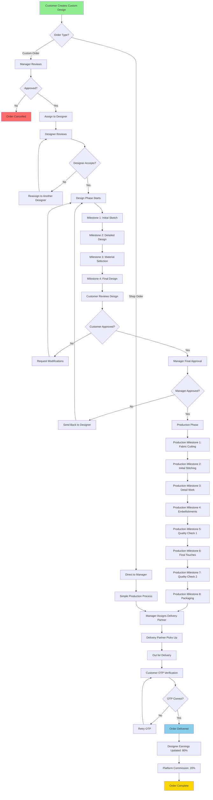

# Custom Order Workflow Diagram

This diagram shows the complete journey of a custom clothing order through the system.

## Workflow Stages

### **1. Order Creation**

- Customer designs in 3D studio
- Customization options selected
- Order submitted to system

### **2. Manager Review**

- Order appears in manager dashboard
- Manager reviews feasibility
- Can approve or reject

### **3. Designer Assignment**

- Manager assigns available designer
- Designer gets notification
- Designer can accept/reject

### **4. Design Phase (4 Milestones)**

1. **Initial Sketch**: Rough concept
2. **Detailed Design**: Technical drawings
3. **Material Selection**: Fabric, colors, patterns
4. **Final Design**: Complete design files

### **5. Customer Approval**

- Customer reviews design files
- Can request modifications
- Approves to move forward

### **6. Manager Approval**

- Final quality check
- Approve to start production
- Can send back for revisions

### **7. Production Phase (8 Milestones)**

1. **Fabric Cutting**: Pattern cutting
2. **Initial Stitching**: Basic assembly
3. **Detail Work**: Intricate stitching
4. **Embellishments**: Decorative elements
5. **Quality Check 1**: First inspection
6. **Final Touches**: Finishing work
7. **Quality Check 2**: Final inspection
8. **Packaging**: Ready for delivery

### **8. Delivery**

- OTP generated for customer
- Delivery partner assigned
- GPS tracking enabled
- OTP verification on delivery

### **9. Completion**

- Designer earns 80% commission
- Platform keeps 20%
- Earnings held for 7 days
- Payout after clearance

## Order Statuses (16 States)

1. `pending` - Initial state
2. `manager_review` - Manager checking
3. `designer_assigned` - Waiting for designer
4. `design_in_progress` - Designer working
5. `design_completed` - Design ready
6. `awaiting_customer_approval` - Customer review
7. `customer_approved` - Customer accepted
8. `awaiting_manager_approval` - Manager review
9. `production_started` - Manufacturing began
10. `production_in_progress` - Manufacturing ongoing
11. `quality_check` - Inspection phase
12. `ready_for_delivery` - Awaiting pickup
13. `out_for_delivery` - In transit
14. `delivered` - Completed successfully
15. `cancelled` - Order cancelled
16. `on_hold` - Temporarily paused

## Timeline Estimates

| Phase               | Estimated Duration |
| ------------------- | ------------------ |
| Manager Review      | 1-2 days           |
| Designer Assignment | 1 day              |
| Design Phase        | 5-7 days           |
| Customer Approval   | 1-3 days           |
| Manager Approval    | 1 day              |
| Production Phase    | 10-15 days         |
| Delivery            | 2-5 days           |
| **Total**           | **21-34 days**     |
