# Database Schema - Entity Relationship Diagram

This diagram shows the complete database structure with 15 MongoDB collections and their relationships.

```mermaid
erDiagram
    USERS ||--o{ ORDERS : places
    USERS ||--o{ DESIGNS : creates
    USERS ||--o{ MESSAGES : sends
    USERS ||--o{ NOTIFICATIONS : receives
    USERS ||--o{ CARTS : has
    USERS ||--o{ WISHLISTS : maintains
    USERS ||--o{ REVIEWS : writes
    USERS ||--o{ FEEDBACKS : submits
    USERS ||--o{ DESIGNER_PORTFOLIOS : owns
    USERS ||--o{ DESIGNER_EARNINGS : earns
    USERS ||--o{ DESIGNER_PAYOUT_REQUESTS : requests

    ORDERS ||--o{ DESIGNS : contains
    ORDERS ||--o{ PRODUCTION_MILESTONES : tracks
    ORDERS ||--o{ MESSAGES : discusses
    ORDERS }o--|| DELIVERY_PARTNERS : "delivered by"

    PRODUCTS ||--o{ CART_ITEMS : "added to"
    PRODUCTS ||--o{ WISHLIST_ITEMS : "saved in"
    PRODUCTS ||--o{ REVIEWS : "reviewed in"

    CARTS ||--o{ CART_ITEMS : contains
    WISHLISTS ||--o{ WISHLIST_ITEMS : contains

    USERS {
        ObjectId _id PK
        string email UK
        string password
        string role "customer|designer|manager|admin|delivery"
        string name
        string phone
        object address
        boolean isApproved
        boolean isAvailable
        date createdAt
    }

    ORDERS {
        ObjectId _id PK
        ObjectId customerId FK
        ObjectId designerId FK
        ObjectId deliveryPartnerId FK
        string orderType "shop|custom"
        string status "16_states"
        array items
        number totalAmount
        string deliveryOtp
        date createdAt
    }

    PRODUCTS {
        ObjectId _id PK
        string name
        string category
        number price
        number stock
        array images
        boolean isActive
    }

    DESIGNS {
        ObjectId _id PK
        ObjectId orderId FK
        ObjectId customerId FK
        ObjectId designerId FK
        object customization
        array designFiles
        string status "pending|in_progress|completed|approved|rejected"
        date createdAt
    }

    MESSAGES {
        ObjectId _id PK
        ObjectId orderId FK
        ObjectId senderId FK
        ObjectId recipientId FK
        string content
        string type "text|image|file"
        boolean isRead
        date createdAt
    }

    CARTS {
        ObjectId _id PK
        ObjectId userId FK
        date createdAt
    }

    CART_ITEMS {
        ObjectId _id PK
        ObjectId cartId FK
        ObjectId productId FK
        number quantity
        number price
    }

    WISHLISTS {
        ObjectId _id PK
        ObjectId userId FK
        date createdAt
    }

    WISHLIST_ITEMS {
        ObjectId _id PK
        ObjectId wishlistId FK
        ObjectId productId FK
        date addedAt
    }

    NOTIFICATIONS {
        ObjectId _id PK
        ObjectId userId FK
        string type
        string message
        boolean isRead
        date createdAt
    }

    REVIEWS {
        ObjectId _id PK
        ObjectId productId FK
        ObjectId userId FK
        number rating "1-5"
        string comment
        date createdAt
    }

    FEEDBACKS {
        ObjectId _id PK
        ObjectId userId FK
        string category
        string message
        string status "pending|reviewed"
        date createdAt
    }

    DESIGNER_PORTFOLIOS {
        ObjectId _id PK
        ObjectId designerId FK
        string title
        string description
        array images
        date createdAt
    }

    DESIGNER_EARNINGS {
        ObjectId _id PK
        ObjectId designerId FK
        ObjectId orderId FK
        number amount
        number commission "80%"
        string status "pending|completed"
        date createdAt
    }

    DESIGNER_PAYOUT_REQUESTS {
        ObjectId _id PK
        ObjectId designerId FK
        number amount
        string status "pending|approved|rejected|paid"
        string bankDetails
        date requestedAt
    }

    PRODUCTION_MILESTONES {
        ObjectId _id PK
        ObjectId orderId FK
        string milestone "8_stages"
        string status "pending|in_progress|completed"
        date completedAt
    }

    DELIVERY_PARTNERS {
        ObjectId _id PK
        string name
        string phone
        string vehicleNumber
        boolean isActive
        array currentDeliveries
    }
```

## Collections Summary

| Collection               | Purpose                      | Key Relationships                |
| ------------------------ | ---------------------------- | -------------------------------- |
| users                    | User accounts (5 roles)      | Core entity                      |
| orders                   | Order tracking (16 statuses) | Links users, designers, delivery |
| products                 | Shop inventory               | Used in cart/wishlist            |
| designs                  | Custom design data           | Links orders and designers       |
| messages                 | Chat system                  | Links users and orders           |
| carts                    | Shopping carts               | Links users and products         |
| wishlists                | Saved items                  | Links users and products         |
| notifications            | User alerts                  | Links to users                   |
| reviews                  | Product reviews              | Links users and products         |
| feedbacks                | Customer feedback            | Links to users                   |
| designer_portfolios      | Designer showcase            | Links to designers               |
| designer_earnings        | Commission tracking          | Links designers and orders       |
| designer_payout_requests | Payout management            | Links to designers               |
| production_milestones    | Progress tracking            | Links to orders                  |
| delivery_partners        | Delivery system              | Links to orders                  |

## Indexes

- `users.email` - Unique index
- `orders.customerId` - Query optimization
- `orders.designerId` - Query optimization
- `orders.status` - Filter optimization
- `designs.orderId` - Reference lookup
- `messages.orderId` - Chat queries
- `cart_items.cartId` - Cart operations
- `reviews.productId` - Product reviews
- `designer_earnings.designerId` - Earnings queries
- `production_milestones.orderId` - Progress tracking
