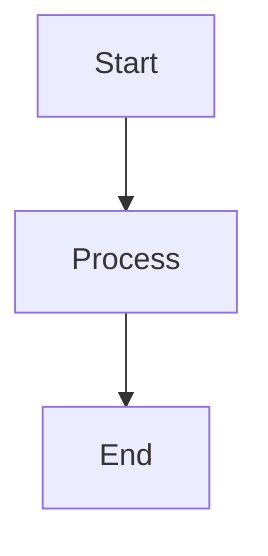

# DesignDen - System Diagrams

This folder contains all the system architecture, workflow, and technical diagrams for the DesignDen platform.

## 📊 Available Diagrams

### **1. [Database Schema ERD](DATABASE_SCHEMA.md)**

Entity Relationship Diagram showing:

- 15 MongoDB collections
- Relationships between collections
- Field types and constraints
- Indexes for performance
- Collection summary table

**Use Case**: Understanding data model, database design, schema planning

---

### **2. [System Architecture](SYSTEM_ARCHITECTURE.md)**

3-Tier architecture diagram showing:

- Frontend layer (React + Vite)
- Backend layer (Express.js)
- Database layer (MongoDB)
- External services integration
- Deployment architecture
- Request flow

**Use Case**: Understanding system design, deployment strategy, tech stack

---

### **3. [Custom Order Workflow](CUSTOM_ORDER_WORKFLOW.md)**

Complete order journey diagram showing:

- 40+ workflow steps
- 16 order statuses
- 4 design milestones
- 8 production milestones
- Approval processes
- Delivery flow with OTP

**Use Case**: Understanding order lifecycle, business logic, user journey

---

### **4. [User Role Interactions](USER_ROLES.md)**

Role-based access control diagram showing:

- 5 user roles (Customer, Designer, Manager, Admin, Delivery)
- Permission matrix
- Role interactions
- Dashboard routes
- Approval requirements

**Use Case**: Understanding permissions, access control, role responsibilities

---

### **5. [3D Design Studio Flow](3D_DESIGN_STUDIO.md)**

User flow through 3D customization showing:

- Clothing type selection
- Customization options
- Price calculation
- Sustainability scoring
- Interactive controls
- Technical implementation

**Use Case**: Understanding design studio, 3D features, customization logic

---

### **6. [Authentication & Security](AUTHENTICATION_FLOW.md)**

Authentication and authorization diagram showing:

- Login flow
- 2FA with OTP
- Session management
- Role-based access
- Security middleware
- CSRF protection

**Use Case**: Understanding security, authentication, authorization

---

## 🎨 Viewing Diagrams

### **Method 1: VS Code (Recommended)**

1. Install "Markdown Preview Mermaid Support" extension
2. Open any diagram `.md` file
3. Press `Cmd+Shift+V` (Mac) or `Ctrl+Shift+V` (Windows/Linux)
4. View rendered Mermaid diagram

### **Method 2: GitHub**

1. Push to GitHub repository
2. View any `.md` file
3. Diagrams auto-render natively

### **Method 3: Online Mermaid Editor**

1. Visit: https://mermaid.live/
2. Copy Mermaid code from any diagram
3. Paste and view/edit online

### **Method 4: Export as Image**

1. Use Mermaid Live Editor
2. Click "Actions" → "PNG" or "SVG"
3. Download high-quality image

---

## 📁 File Structure

```
docs/diagrams/
├── README.md                      # This file
├── DATABASE_SCHEMA.md             # ERD diagram
├── SYSTEM_ARCHITECTURE.md         # Architecture diagram
├── CUSTOM_ORDER_WORKFLOW.md       # Order flow diagram
├── USER_ROLES.md                  # Role interactions
├── 3D_DESIGN_STUDIO.md           # Design studio flow
└── AUTHENTICATION_FLOW.md         # Auth & security flow
```

---

## 🔧 Diagram Format

All diagrams use **Mermaid** syntax:

- **Language**: Declarative diagram language
- **Format**: Markdown code blocks with `mermaid` tag
- **Rendering**: Supported by GitHub, VS Code, GitLab
- **Export**: Can export to PNG, SVG, PDF

Example:

````markdown

````

---

## 📚 Diagram Types Used

| Type         | Description                 | Files                                            |
| ------------ | --------------------------- | ------------------------------------------------ |
| **ERD**      | Entity Relationship Diagram | DATABASE_SCHEMA.md                               |
| **Graph**    | Directional flow diagrams   | Most diagrams                                    |
| **Subgraph** | Grouped components          | SYSTEM_ARCHITECTURE.md, USER_ROLES.md            |
| **Decision** | Conditional branching       | CUSTOM_ORDER_WORKFLOW.md, AUTHENTICATION_FLOW.md |

---

## 🎯 Quick Reference

### **For Developers**

- **Database Design** → [DATABASE_SCHEMA.md](DATABASE_SCHEMA.md)
- **API Architecture** → [SYSTEM_ARCHITECTURE.md](SYSTEM_ARCHITECTURE.md)
- **Auth Implementation** → [AUTHENTICATION_FLOW.md](AUTHENTICATION_FLOW.md)

### **For Designers**

- **3D Studio** → [3D_DESIGN_STUDIO.md](3D_DESIGN_STUDIO.md)
- **User Flows** → [CUSTOM_ORDER_WORKFLOW.md](CUSTOM_ORDER_WORKFLOW.md)

### **For Product Managers**

- **Order Workflow** → [CUSTOM_ORDER_WORKFLOW.md](CUSTOM_ORDER_WORKFLOW.md)
- **User Roles** → [USER_ROLES.md](USER_ROLES.md)
- **System Overview** → [SYSTEM_ARCHITECTURE.md](SYSTEM_ARCHITECTURE.md)

### **For Stakeholders**

- **Business Flow** → [CUSTOM_ORDER_WORKFLOW.md](CUSTOM_ORDER_WORKFLOW.md)
- **System Capabilities** → All diagrams

---

## 📝 Updating Diagrams

When updating diagrams:

1. **Edit the Mermaid code** in the `.md` file
2. **Preview** using VS Code or Mermaid Live
3. **Verify** syntax and rendering
4. **Commit** changes to repository
5. **Document** what changed in commit message

---

## 🔗 Related Documentation

- [Project README](../../README.md) - Project overview
- [Team Contributions](../../TEAM_CONTRIBUTIONS.md) - Team member details
- [Technical Specs](../../TECHNICAL_SPECIFICATIONS.md) - Technical documentation
- [API Documentation](../../API_DOCUMENTATION.md) - API reference
- [Wireframes](../../WIREFRAMES.md) - UI layouts
- [Project Summary](../../PROJECT_SUMMARY.md) - Documentation index

---

## 🆘 Support

For issues with diagrams:

- **Syntax errors**: Check Mermaid documentation at https://mermaid.js.org/
- **Rendering issues**: Try Mermaid Live Editor
- **Questions**: Contact kumaritsme1510@gmail.com

---

**Last Updated**: March 2, 2026  
**Maintained By**: DesignDen Development Team  
**Diagram Count**: 6

---

## 📊 Diagram Statistics

| Diagram                | Nodes    | Edges    | Complexity |
| ---------------------- | -------- | -------- | ---------- |
| Database Schema        | 15       | 25+      | High       |
| System Architecture    | 14       | 12       | Medium     |
| Custom Order Workflow  | 60+      | 70+      | Very High  |
| User Role Interactions | 35+      | 15+      | High       |
| 3D Design Studio       | 55+      | 65+      | Very High  |
| Authentication Flow    | 50+      | 55+      | Very High  |
| **Total**              | **230+** | **240+** | -          |

---

**End of Diagrams Documentation**
