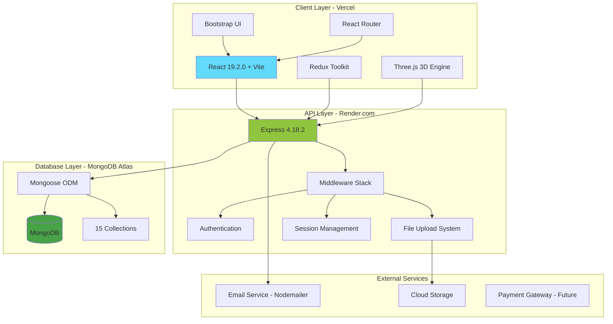

# System Architecture Diagram

This diagram illustrates the 3-tier architecture of the DesignDen platform.



## Architecture Components

### **Frontend (Vercel)**

- **Framework**: React 19.2.0 with Vite build tool
- **State Management**: Redux Toolkit + Context API
- **3D Graphics**: Three.js, @react-three/fiber, @react-three/drei
- **UI Framework**: Bootstrap 5.3.8
- **Routing**: React Router v6
- **Deployment**: Vercel with auto-deploy

### **Backend (Render.com)**

- **Framework**: Express 4.18.2 (Node.js)
- **File Size**: 10,266 lines (server.cjs)
- **API Endpoints**: 100+
- **Authentication**: Session-based with bcrypt
- **File Uploads**: Multer (50MB limit)
- **Email**: Nodemailer for 2FA

### **Database (MongoDB Atlas)**

- **Type**: NoSQL Document Database
- **ODM**: Mongoose 8.0.0
- **Collections**: 15
- **Region**: AWS ap-south-1 (Mumbai)
- **Backup**: Daily snapshots

### **Security Middleware Stack**

1. Helmet - Security headers
2. CORS - Cross-origin resource sharing
3. Rate Limiter - Brute-force protection
4. Compression - Gzip compression
5. Morgan - HTTP request logging
6. Body Parser - JSON/URL encoding
7. Cookie Parser - Session cookies
8. Multer - File upload validation
9. CSRF - Token protection (checkout)

## Request Flow

```
User Request → React App → API Call → Express Middleware →
Route Handler → Mongoose Query → MongoDB → Response →
State Update → UI Re-render
```

## Deployment Architecture

```
┌─────────────────────────────────────────┐
│   Vercel (Frontend)                     │
│   - CDN Distribution                    │
│   - Auto SSL                            │
│   - Edge Network                        │
│   URL: design-den1.vercel.app           │
└─────────────────────────────────────────┘
                    ↓ HTTPS
┌─────────────────────────────────────────┐
│   Render.com (Backend)                  │
│   - Auto-scaling                        │
│   - Health Checks                       │
│   - Environment Variables               │
│   URL: backend-gw9o.onrender.com        │
└─────────────────────────────────────────┘
                    ↓ MongoDB Protocol
┌─────────────────────────────────────────┐
│   MongoDB Atlas (Database)              │
│   - Replica Set                         │
│   - Auto Backups                        │
│   - Connection Pooling                  │
└─────────────────────────────────────────┘
```

## Performance Optimizations

- **Code Splitting**: 3 vendor bundles
- **Lazy Loading**: Route-based and 3D models
- **Compression**: Gzip (65% reduction)
- **Caching**: Static assets, API responses
- **Database**: Indexed queries, connection pooling
- **CDN**: Vercel edge network
