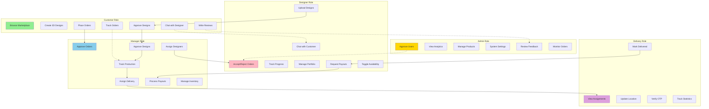

# User Role Interactions Diagram

This diagram shows the 5 user roles and their interactions within the system.

## Role Permissions Matrix

| Feature               | Customer | Designer | Manager | Admin | Delivery |
| --------------------- | -------- | -------- | ------- | ----- | -------- |
| **Authentication**    |
| Register/Login        | ✅       | ✅       | ✅      | ✅    | ✅       |
| Email 2FA             | ✅       | ✅       | ✅      | ✅    | ✅       |
| Profile Edit          | ✅       | ✅       | ✅      | ✅    | ✅       |
| **Products & Orders** |
| Browse Products       | ✅       | ✅       | ❌      | ✅    | ❌       |
| 3D Design Studio      | ✅       | ❌       | ❌      | ❌    | ❌       |
| Place Orders          | ✅       | ❌       | ❌      | ❌    | ❌       |
| View Own Orders       | ✅       | ✅       | ✅      | ✅    | ✅       |
| View All Orders       | ❌       | ❌       | ✅      | ✅    | ❌       |
| **Design Management** |
| Upload Designs        | ❌       | ✅       | ❌      | ❌    | ❌       |
| Approve Designs       | ✅ (own) | ❌       | ✅      | ❌    | ❌       |
| Modify Designs        | ❌       | ✅       | ❌      | ❌    | ❌       |
| **Order Management**  |
| Accept/Reject Orders  | ❌       | ✅       | ❌      | ❌    | ❌       |
| Assign Designers      | ❌       | ❌       | ✅      | ❌    | ❌       |
| Track Production      | ✅       | ✅       | ✅      | ✅    | ❌       |
| Update Milestones     | ❌       | ✅       | ✅      | ❌    | ❌       |
| **Delivery**          |
| Assign Delivery       | ❌       | ❌       | ✅      | ❌    | ❌       |
| View Deliveries       | ❌       | ❌       | ❌      | ❌    | ✅       |
| Update GPS Location   | ❌       | ❌       | ❌      | ❌    | ✅       |
| Verify OTP            | ❌       | ❌       | ❌      | ❌    | ✅       |
| **Financial**         |
| View Earnings         | ❌       | ✅       | ❌      | ✅    | ❌       |
| Request Payout        | ❌       | ✅       | ❌      | ❌    | ❌       |
| Process Payout        | ❌       | ❌       | ✅      | ❌    | ❌       |
| **Communication**     |
| Chat with Designer    | ✅       | ❌       | ❌      | ❌    | ❌       |
| Chat with Customer    | ❌       | ✅       | ❌      | ❌    | ❌       |
| Send Notifications    | ❌       | ❌       | ✅      | ✅    | ❌       |
| **Administration**    |
| Approve Users         | ❌       | ❌       | ❌      | ✅    | ❌       |
| Manage Products       | ❌       | ❌       | ✅      | ✅    | ❌       |
| View Analytics        | ❌       | ❌       | ✅      | ✅    | ❌       |
| System Settings       | ❌       | ❌       | ❌      | ✅    | ❌       |
| **Feedback**          |
| Submit Feedback       | ✅       | ✅       | ✅      | ❌    | ✅       |
| Review Feedback       | ❌       | ❌       | ❌      | ✅    | ❌       |
| Write Product Reviews | ✅       | ❌       | ❌      | ❌    | ❌       |

## Role Details

### **👤 Customer**

**Dashboard**: Order history, wishlist, cart, design studio access
**Key Features**:

- Browse designer marketplace
- Create custom designs in 3D studio
- Real-time order tracking
- Chat with assigned designer
- Approve/reject design submissions
- Write product reviews
- Submit feedback

**Approval Required**: No (auto-approved on signup)

### **🎨 Designer**

**Dashboard**: Active orders, earnings, portfolio, payout requests
**Key Features**:

- Accept/reject incoming orders
- Upload design files (4 milestones)
- Chat with customers
- Portfolio management
- Earnings tracking (80% commission)
- Payout requests (₹500 minimum)
- Availability toggle

**Approval Required**: Yes (admin approval needed)

### **👔 Manager**

**Dashboard**: All orders, designer assignments, production tracking
**Key Features**:

- Approve/reject new orders
- Assign orders to designers
- Approve final designs
- Track production milestones (8 stages)
- Assign delivery partners
- Process designer payouts
- Inventory management
- Analytics dashboard

**Approval Required**: Yes (admin approval needed)

### **🔧 Admin**

**Dashboard**: System overview, analytics, user management
**Key Features**:

- Approve new users (designer, manager, delivery)
- Complete system analytics
- Product management (CRUD)
- View all orders and statistics
- Review customer feedback
- System settings
- User role management

**Approval Required**: No (created manually)

### **🚚 Delivery Partner**

**Dashboard**: Assigned deliveries, statistics, history
**Key Features**:

- View assigned deliveries
- Update GPS location
- OTP verification at delivery
- Mark orders as delivered
- Delivery history
- Performance statistics

**Approval Required**: Yes (admin approval needed)

## Workflow Interactions

### **Customer → Designer**

- Customer places custom order
- Designer accepts order
- Two-way chat communication
- Designer uploads design files
- Customer approves/rejects designs

### **Manager → Designer**

- Manager assigns orders
- Designer accepts/rejects
- Manager tracks designer progress
- Manager approves final designs
- Manager processes designer payouts

### **Manager → Delivery**

- Manager assigns delivery partner
- Delivery partner receives notification
- Delivery updates tracked
- OTP verification coordinated

### **Admin → All Users**

- Admin approves new users
- Admin monitors system activity
- Admin reviews feedback
- Admin manages products

## Dashboard Routes

| Role     | Route                 |
| -------- | --------------------- |
| Customer | `/customer/dashboard` |
| Designer | `/designer/dashboard` |
| Manager  | `/manager/dashboard`  |
| Admin    | `/admin/dashboard`    |
| Delivery | `/delivery/dashboard` |
